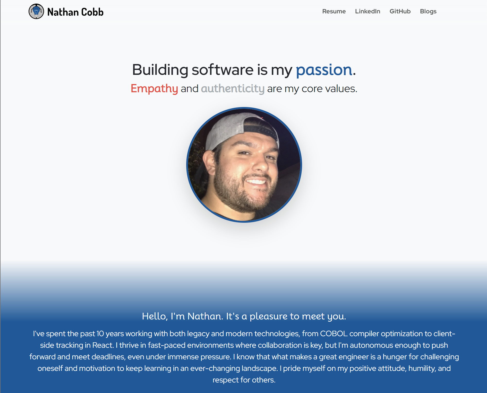

# [Django Portfolio](https://www.nathanrcobb.com) ·   



## Description

A Django-powered portfolio, with a Bootstrap frontend.

What began as a fairly simple portfolio web app, blossomed into a custom-built personal portfolio website to showcase my work. My previous portfolios were built using WordPress, but I decided to do it right this time.

### Why Django?

I've always had a love for Django since I was introduced to it in 2017, but I've never really built a relatively simple web app of my own with it. I've tended to use Flask for smaller projects, and Django for larger projects, so this was an excellent excuse to build something on the simpler side in Django.

### Why Bootstrap?

I've worked with Bootstrap before, but never really got the chance to take full advantage of it to build something beautiful. Historically, I've always used it as a means of improving the look of a fairly basic UI. With the frontend skills I've gained over the past 2 years, I decided to give it a shot and I'm fairly impressed by its capabilities.

## Installation

Here are the things you'll need if you want to run this project locally:

1. [Python](https://www.python.org/downloads/)
2. [Django](https://www.djangoproject.com/download/)

Once the above two are installed:

1. Clone this repository
2. Open a terminal and navigate to the Django project's root directory (`personal_portfolio-project`)
3. Install the required packages

   ```shell
   pip install -r requirements.txt
   ```

## Usage

To run the Django project locally, you'll need to create a local file named `.env` in the same directory as `manage.py`. This file is used to set some sensitive environment variables used by the project. A template is provided, named `.env.template`. All you need to do is set the `SECRET_KEY` in that file to some random string value.

After creating the `.env` file, you'll need to run the commands required to build the local database:

```shell
python manage.py makemigrations portfolio
python manage.py makemigrations blog
python manage.py migrate
```

Once the database is built, you can run the server:

```shell
python manage.py runserver
```

## Credits

This project uses icons from [Google Fonts](https://fonts.google.com/), fonts from [Google Fonts](https://fonts.google.com/) under the [Open Font License](https://scripts.sil.org/cms/scripts/page.php?site_id=nrsi&id=OFL), and brand icons from [Font Awesome](https://fontawesome.com/icons).

## License

This project is [MIT Licensed](https://github.com/nathanrcobb/django-portfolio/blob/main/LICENSE)
